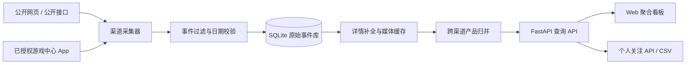

# CN New Game Radar / 国内新游雷达

面向中国区游戏发行与市场研究场景的多渠道新游监控系统。项目从公开网页、公开接口及用户自行授权的游戏中心 App 页面采集“上线、首发、预下载、预约、测试招募、开测”等事件，完成结构化入库、跨渠道同款归并、图片本地缓存，并通过 Web 看板统一查询与展示。

> 本仓库只包含源码、通用配置示例、测试和部署模板。数据库、账号数据、Cookie/Token、原始抓取证据、商店图片缓存、APK、日志、本机路径及私有部署配置均不在版本库中。

## 核心能力

- **多渠道采集**：覆盖 TapTap、华为、荣耀、小米、OPPO、vivo、4399、233 乐园、好游快爆、UC 九游和 App Store 中国区。
- **事件质量控制**：区分产品首发与普通版本更新、赛季、联动、角色/皮肤活动，避免把老游戏运营动态误判为新游。
- **日期语义校验**：优先保存渠道明确公布的计划日期；采集日与首次发现日不会冒充首发日。
- **跨渠道归并**：按规范化名称和渠道标识聚合相同产品，详情中保留完整来源标签与渠道事件轨迹。
- **资料补全**：聚合开发商、品类、玩法简介、完整介绍、Icon、评分、版本、包体和图集；缺失字段可按同名产品从公开详情页降级补全。
- **媒体缓存**：远程 Icon 和图集校验后转为本地 WebP，减少防盗链、临时 URL 和渠道网络波动带来的缺图。
- **聚合看板**：支持今日/周/月/全部、自定义日期、事件日历、关键词及品类/厂商/渠道/事件类型筛选。
- **账号与关注**：支持角色权限、产品关注、关注日志、CSV 导出，以及由个人 API Key 读取关注列表。
- **可观测性**：记录每个采集器的运行批次、状态、数量和错误，并提供数据完整度与健康检查。

## 渠道与采集方式

| 渠道 | CLI 名称 | 主要方式 | 典型事件 | 运行环境 |
|---|---|---|---|---|
| TapTap | `taptap` | 公开新游页与详情页 | 待上线、预约、测试 | 服务器/本机 |
| Apple App Store 中国区 | `ios-cn` | Apple 公开专题、RSS、Lookup | 上架、预订 | 服务器/本机 |
| 华为游戏中心 | `huawei-cache` | 已授权 App 的公开业务缓存；公开详情补全 | 新游、测试 | Android 设备/模拟器 |
| 荣耀游戏中心 | `honor-ui` | 已授权 App 的可见页面 | 首发、内测 | Android 设备/模拟器 |
| 小米游戏中心 | `xiaomi` | 匿名公开数据；`xiaomi-cache` 为设备降级源 | 内测、预约 | 服务器/本机 |
| OPPO 游戏中心 | `oppo-ui` | 已授权 App 的可见页面 | 首发、招募、内测 | Android 设备/模拟器 |
| vivo 游戏中心 | `vivo` | 匿名公开数据与公开详情 | 首发、测试 | 服务器/本机 |
| 4399 游戏盒 | `4399` | 公开网页 | 预约、开测 | 服务器/本机 |
| 233 乐园 | `233` | 公开 SSR 与详情页 | 上线、测试 | 服务器/本机 |
| 好游快爆 | `3839` | 公开时间轴与详情页 | 首发、预下载、测试 | 服务器/本机 |
| UC 九游 | `9game` | 公开开测表与游戏专区 | 首发、公测、测试 | 服务器/本机 |

厂商 App 采集器只读取普通用户在界面中可见的新游/测试业务内容，不读取账号表、密码、Cookie、登录令牌或设备唯一标识，也不会自动执行预约、安装、下载、支付等动作。使用者应自行确认平台条款、授权范围和所在地区法律要求。

## 系统结构



主要目录：

```text
src/newgame_monitor/
├── collectors.py            # 公开渠道采集器
├── app_cache_collectors.py  # Android App 页面/业务缓存采集器
├── event_quality.py         # 新游事件过滤与历史误分类清理
├── enrichment.py            # 详情、开发商、介绍与图集补全
├── icon_cache.py            # Icon 下载、校验与 WebP 缓存
├── gallery.py               # 商店图集下载与归一
├── db.py                    # SQLite 表结构与幂等写入
├── catalog.py               # 跨渠道产品归并与完整度审计
├── auth.py                  # 账号、权限、会话和 API Key
├── webapp.py                # FastAPI 服务
└── static/                  # 原生 HTML/CSS/JavaScript 看板

tests/                       # 单元与 API 测试
deploy/                      # systemd 定时任务和通用部署模板
scripts/                     # 采集、审计与修复工具
```

## 数据模型

- `source_items`：渠道事件明细，保存来源 ID、事件类型、渠道日期、短简介、完整介绍及原始字段。
- `canonical_games`：跨渠道归并后的产品目录。
- `canonical_members`：产品与各渠道事件的多对多关系。
- `collection_runs`：每次采集的开始/结束时间、状态、数量和错误。
- `icon_assets`、`screenshot_assets`：媒体原地址、本地路径、尺寸及缓存状态。
- `users`、`user_sessions`：账号与会话。
- `favorites`、`favorite_logs`：关注关系与操作日志。
- `user_api_keys`：个人 API Key 摘要；完整密钥只在创建时返回一次。

采集写入使用“来源 + 来源产品 ID + 事件类型 + 事件时间”的业务键保证幂等。没有明确渠道日期的事件保留首次发现时间，并与计划日期分别展示。

## 快速开始

### 1. 环境要求

- Python 3.11+
- Windows PowerShell 或 Linux/macOS Shell
- 运行 App 渠道时另需 Android 调试桥（ADB）以及用户自行授权登录的设备/模拟器

### 2. 安装

```bash
git clone https://github.com/dxawdc/cn-newgame-radar.git
cd cn-newgame-radar
python -m venv .venv
```

Windows：

```powershell
.\.venv\Scripts\Activate.ps1
python -m pip install -r requirements.txt
$env:PYTHONPATH = (Resolve-Path .\src).Path
```

Linux/macOS：

```bash
source .venv/bin/activate
python -m pip install -r requirements.txt
export PYTHONPATH="$PWD/src"
```

### 3. 配置首次管理员

系统不会创建带固定公开口令的默认账号。首次启动一个全新数据库前，必须自行设置管理员账号与高强度随机密码：

```powershell
$env:NEWGAME_BOOTSTRAP_USERNAME = "your-admin"
$env:NEWGAME_BOOTSTRAP_PASSWORD = "请替换为独立的长随机密码"
```

配置项可参考 [.env.example](.env.example)。项目不会自动读取 `.env`；请通过进程管理器、容器编排或当前 Shell 注入环境变量。管理员创建后，后续启动仍应保留这两个变量，应用会复用已有账号而不会覆盖密码。

### 4. 采集数据

只运行无需 Android 登录态的来源：

```powershell
python -m newgame_monitor.cli `
  --sources taptap ios-cn xiaomi vivo 4399 233 3839 9game
```

指定数据目录：

```powershell
python -m newgame_monitor.cli `
  --sources taptap ios-cn `
  --db data/newgame_monitor.db `
  --raw-dir raw `
  --icon-dir data/icons `
  --screenshot-dir data/screenshots
```

每次运行会依次执行采集、幂等入库、事件清理、详情补全、产品归并、完整度审计及媒体缓存，并在标准输出返回 JSON 汇总。单个渠道失败会记录在 `collection_runs`，其他渠道仍继续执行。

### 5. 启动看板

```powershell
.\scripts\run_dashboard.ps1
```

或直接运行：

```bash
python -m uvicorn newgame_monitor.webapp:app --host 127.0.0.1 --port 8765
```

访问 `http://127.0.0.1:8765/`。

## Android / 模拟器渠道

先将 ADB 加入 `PATH`，或设置：

```powershell
$env:NEWGAME_ADB = "C:\path\to\adb.exe"
$env:NEWGAME_ADB_SERIAL = "127.0.0.1:16384"
```

然后在设备中打开相应游戏中心的新游/测试页面，再执行：

```powershell
python -m newgame_monitor.cli `
  --sources huawei-cache honor-ui oppo-ui `
  --ui-details
```

`--ui-details` 会逐项打开荣耀/OPPO 详情页补充开发商、标签、介绍和媒体，耗时明显高于列表刷新。可从 [scripts/run_simulator_daily.example.ps1](scripts/run_simulator_daily.example.ps1) 复制一份本机脚本；包含设备路径、SSH 主机或部署地址的实际脚本应继续留在 Git 之外。

## 看板与 API

页面能力包括：

- 今日默认视图，支持本周、本月、全部和自定义日期；
- 事件日历与日期筛选联动；
- 按关键词、品类、开发/发行商、来源渠道和事件类型组合筛选；
- 卡片/列表视图、分页和排序；
- 产品详情、完整介绍、来源事件轨迹和自适应图集；
- 图集点击放大、鼠标按钮和键盘方向键切换；
- 已登录用户关注、只看关注、关注时间、CSV 导出；
- 管理员用户管理与个人 API Key 管理。

常用接口：

| 方法 | 路径 | 用途 |
|---|---|---|
| `GET` | `/api/summary` | 日/周/月/全库统计 |
| `GET` | `/api/games` | 产品列表及组合筛选 |
| `GET` | `/api/games/{id}` | 产品详情与渠道事件 |
| `GET` | `/api/calendar` | 日期事件分布 |
| `GET` | `/api/filters` | 可选筛选项 |
| `GET` | `/api/health` | 采集器运行状态 |
| `GET` | `/api/v1/favorites` | 使用个人 API Key 读取关注产品 |

个人关注 API 示例：

```bash
curl -H "Authorization: Bearer ngr_your_api_key" \
  http://127.0.0.1:8765/api/v1/favorites
```

## 每日定时运行

`deploy/newgame-monitor-daily.service` 与 `deploy/newgame-monitor-daily.timer` 提供通用 systemd 示例，默认每天北京时间 06:00 执行无需 Android 登录态的渠道。部署前请按实际用户、目录、虚拟环境和反向代理路径修改模板。

Windows 可使用任务计划程序执行 `scripts/run_daily.ps1`。需要模拟器与远端同步时，应从示例脚本复制为本机专用脚本，并通过环境变量或 Git 忽略的本地配置保存设备路径、SSH 别名和健康检查地址。

## 测试

```powershell
$env:PYTHONPATH = (Resolve-Path .\src).Path
python -m pytest -q
```

测试覆盖渠道解析、事件日期、误分类过滤、跨渠道归并、字段补全、Icon/图集、账号权限、关注/API Key、同步包以及 Web API。

## 安全与合规

- 不要提交数据库、原始响应、截图、日志、APK、`.env`、SSH 密钥或任何账号登录材料。
- 生产环境必须使用 HTTPS，并设置 `NEWGAME_COOKIE_SECURE=1`。
- 为管理员设置独立强密码；不要把生产口令写入脚本、服务文件或命令历史。
- 个人 API Key 只在创建时显示一次；如怀疑泄露，请立即撤销并重新生成。
- 对外部平台设置合理频率、超时和重试，遵守服务条款、robots 规则、著作权及数据使用限制。
- App 采集只应在有权使用的账号和设备上运行，不绕过验证码、证书固定、权限控制或安全检测。
- 上游页面与接口可能随时改版；请结合 `collection_runs` 和 `/api/health` 设置失败与数据量异常告警。

## 已知限制

- App 渠道受登录态、机型、地区、AB 实验和页面改版影响，稳定性通常低于公开网页来源。
- App Store 中国区免费链路主要用于发现与上架日期校验，不保证覆盖所有预订和小规模新游。
- 游戏改名、副标题、港台译名或同名产品可能需要人工别名规则。
- 部分商店不提供可稳定归属的原图，历史产品可能只有 Icon 或暂时显示占位图。
- 本项目当前使用 SQLite，适合单机与中小规模任务；高并发写入或多实例部署应迁移到服务型数据库。

## 许可

本仓库当前未附带开源许可证。公开可见不代表自动授予复制、修改、分发或商业使用权；如需使用，请先联系仓库所有者。
